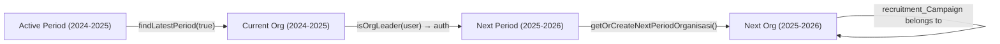

# moklet.org — Project Review & Documentation

> SMK Telkom Malang's integrated school portal and student-organization management system.
> **moklet** = the school's nickname.

---

## Table of Contents

1. [General Overview](#1-general-overview)
2. [Tech Stack](#2-tech-stack)
3. [Route Groups & Surface Areas](#3-route-groups--surface-areas)
4. [Feature Modules](#4-feature-modules)
5. [Data Model](#5-data-model)
6. [Authentication & Authorization](#6-authentication--authorization)
   - [Three-tier authorization](#three-tier-authorization)
   - [Period-based scoping](#period-based-scoping)
7. [Directory Conventions](#7-directory-conventions)
8. [Deployment & Environment](#8-deployment--environment)
9. [Recruitment Feature — Lifecycle Deep-dive](#9-recruitment-feature--lifecycle-deep-dive)
10. [Strict Code Review — Findings & Fixes](#10-strict-code-review--findings--fixes)
    - [CRITICAL](#critical)
    - [HIGH](#high)
    - [MEDIUM](#medium)
    - [LOW](#low)
    - [Fix summary](#fix-summary)
11. [Dormant Bugs (observed, not fixed)](#11-dormant-bugs-observed-not-fixed)
12. [Genuinely Good Patterns](#12-genuinely-good-patterns)

---

## 1. General Overview

**What it is**: moklet.org is the official web platform for SMK Telkom Malang, a vocational high school. It serves two audiences:

- **Students / Guests** — A public portal to read news, explore student organisations, submit aspirations, view recruitment opportunities, participate in twibbon campaigns, and fill out school forms.
- **Admin / Organisation leaders** — A dashboard to manage content (news, events, links, forms), organisation membership and permissions, recruitment pipelines, and aspiration routing.

**What problem it solves**: Before moklet.org, the school relied on physical bulletin boards (mading), Google Forms, paper-based aspirations, and WhatsApp announcements. This platform consolidates all student-governance activities into one place, with structured workflows for:

- **Organisation transitions** (periods of governance, leadership handover via recruitment)
- **Granular permissions** (who can edit org info, manage members, publish posts)
- **Multi-step recruitment** campaigns with custom forms per step
- **Audit trails** for every acceptance, rejection, and permission change
- **WhatsApp notifications** for aspirations, member changes, and post publications
- **Rate-limited public submissions** to prevent spam on forms and aspirations

**Key concept — Periods**: The school operates in governance periods (e.g. 2024–2025, 2025–2026). Current leaders manage _next period's_ recruitment. Past periods are immutable. This is the central design constraint in the authorization model.

---

## 2. Tech Stack

| Layer | Technology | Version |
|---|---|---|
| Framework | Next.js (App Router) | ^16.1.6 |
| UI Library | React | ^19.2.4 |
| Language | TypeScript | ^5.7.3 |
| Database | PostgreSQL (via Supabase) | — |
| ORM | Prisma | ^7.3.0 |
| Database adapter | `@prisma/adapter-pg` + `pg` | ^7.3.0 / ^8.18.0 |
| Auth | NextAuth (Auth.js v5) | ^5.0.0-beta.30 |
| Providers | Google OAuth + Credentials (bcrypt) | — |
| Styling | Tailwind CSS 3.4 + `styled-components` | ^3.4.17 / ^6.1.14 |
| Media storage | Cloudinary v2 + ImgBB (fallback) | ^2.9.0 |
| Caching / rate limit | Upstash Redis + Ratelimit | — |
| Realtime | Server-Sent Events (SSE) via Redis ping | — |
| Notifications | Fonnte (WhatsApp API) | — |
| Tables | `react-data-table-component` | ^7.7.0 |
| Excel export | `write-excel-file` | ^2.0.7 |
| Carousel | `embla-carousel-react` + autoplay | ^8.6.0 |
| Charts | `recharts` + `echarts` | ^2.15.1 / ^6.0.0 |
| Markdown | `@uiw/react-md-editor` + remark/rehype stack | — |

---

## 3. Route Groups & Surface Areas

The App Router uses route groups (parenthesised folders) to give each surface its own layout.

| Route group | Folder(s) | Purpose |
|---|---|---|
| **(main)** | `aspirasi/`, `berita/`, `organisasi/`, `recruitment/`, `kontributor/`, `tentang/`, `policies/`, `page.tsx` | Public-facing school portal. Homepage, news, org profiles, aspirations, recruitment listings, contributors, about, policies. ISR with `revalidate = 60`. |
| **(admin)** | `admin/` | Authenticated dashboard. Sub-routes: `posts`, `events`, `link`, `form`, `twibbon`, `organisasi`, `recruitment`, `aspirasi`, `period-config`, `permissions`, `users`, `settings`. `revalidate = 900`. |
| **(form)** | `form/` | Dynamic form-filling surface — internal "Google Forms" replacement. |
| **(twibbon)** | `twbn/` | Public twibbon frame generator (photo → frame → download, client-side). |
| **(linkshortener)** | `link/` | Short-link redirect surface (`s.moklet.org/...`), optional password + QR. |

---

## 4. Feature Modules

| # | Module | Description | Key admin routes | Key public routes |
|---|---|---|---|---|
| 1 | **Posts / Berita (CMS)** | Rich Markdown articles with tags, thumbnails, draft/publish, view counts, reactions, OG metadata. | `admin/posts` | `berita/` |
| 2 | **Events** | Events owned by an org or user, with hierarchical levels, custom roles, members, ACTIVE/DRAFT/COMPLETED status. | `admin/events` | — (admin only) |
| 3 | **Aspirasi** | Rate-limited (3/min per user) anonymous-or-named student submissions. Targeted at a school unit or org. Triggers WhatsApp to the responsible party. | `admin/aspirasi` | `aspirasi/` |
| 4 | **Organisasi** | Multi-period org structure with hierarchy levels, custom roles, members, granular permissions, and drag-and-drop organogram. | `admin/organisasi` | `organisasi/[period]/[slug]` |
| 5 | **Recruitment** | Campaigns tied to an org + form, with ordered multi-step pipelines (ANNOUNCEMENT or FORM steps), applicant tracking, per-step status. | `admin/recruitment`, `admin/organisasi/*/recruitment/*` | `recruitment/` |
| 6 | **Twibbon** | Photo/video frame overlay generator, client-side compositing. | `admin/twibbon` | `twbn/` |
| 7 | **Link Shortener** | URL shortener with click counting, optional password, user/system link types. | `admin/link` | `link/[slug]` |
| 8 | **Forms** | Dynamic form builder with 8 field types (text, number, email, password, longtext, radio, checkbox, **file**), Excel export, anti-spam. | `admin/form` | `form/[id]` |
| 9 | **Users** | User + auth management, member onboarding by email. | `admin/users` | — |
| 10 | **Permissions** | Granular per-org permissions plus reusable permission templates. | `admin/permissions` | — |
| 11 | **Period Config** | Manage governance periods (e.g. 2024/2025), activate one at a time. | `admin/period-config` | — |
| 12 | **Notifications** | In-app notifications with read tracking + WhatsApp dispatch. | — (in-app) | — |

---

## 5. Data Model

The Prisma schema (`prisma/schema.prisma`, 561 lines) defines about 28 models. Below are the key models and their relationships.

### Core identity

```
User (user_id*) ──1:1──► User_Auth (userauth_id)
   │
   ├──◊── Org_Member ──► Org_Custom_Role ──► Org_Level ──► Organisasi ──► Period_Year
   ├──◊── Event_Member ──► Event_Custom_Role ──► Event_Level ──► Event
   ├──◊── Org_Permission (user_id, organisasi_id, permission)
   ├──◊── Submission (form-filling / recruitment applications)
   ├──◊── Post, Aspirasi, Twibbon, Link_Shortener, Notification
```

### Organisation & permissions

```
Period_Year (periode_year_id*, period: unique, is_active)
   │
   └──◊── Organisasi (suborgan_id*)
            │  @@unique([organisasi, period_id])  ← one org type per period
            ├──◊── Org_Level (name, order) @@unique([name, organisasi_id])
            ├──◊── Org_Custom_Role (name, is_leader, hierarchy_level) @@unique([name, organisasi_id])
            ├──◊── Org_Member (user_id, organisasi_id, role_id) @@unique([user_id, organisasi_id])
            ├──◊── Org_Permission (user_id, permission) @@unique([user_id, organisasi_id, permission])
            └──◊── Recruitment_Campaign
```

### Recruitment pipeline

```
Recruitment_Campaign (id*)
   │  ──► Organisasi (owner)
   │  ──► Form (application form)
   │  optional: default_role_id
   │
   ├──◊── Recruitment_Step (name, order, type: ANNOUNCEMENT|FORM, announcement_date?)
   │        ──► optional Form (step-level inline form)
   │
   └──◊── Recruitment_Applicant (status: PENDING|ACCEPTED|REJECTED)
            @@unique([campaign_id, user_id])
            │  ──► User
            │  ──► Submission (the form answers)
            │
            └──◊── Applicant_Step_Status (status: PENDING|PASSED|FAILED)
                     @@unique([applicant_id, step_id])
```

### Forms engine

```
Form (form_id*)
   ├──◊── Field (label, type: Field_Type, required, fieldNumber, accept_types?)
   │        └──◊── Field_Option (value)
   └──◊── Submission (user_id)
            └──◊── Submission_Field (field_id, value)
```

### Enums (verbatim values)

```prisma
enum Roles     { SuperAdmin, Admin, OSIS, MPK, BDI, PALWAGA, PASKATEMA, TSBC, TSFC, TSVC, TSCC, PMR, MEMO, MAC, METIC, COMET, DA, PUSTEL, Guest }
enum Field_Type { text, number, email, password, longtext, radio, checkbox, file }
enum Organisasi_Type { OSIS, MPK, BDI, PALWAGA, PASKATEMA, TSBC, TSFC, TSVC, TSCC, PMR, MEMO, MAC, METIC, COMET, PUSTEL, DA }
enum EventStatus { DRAFT, ACTIVE, COMPLETED }
enum ApplicantStatus { PENDING, ACCEPTED, REJECTED }
enum StepStatus { PENDING, PASSED, FAILED }
enum StepType { ANNOUNCEMENT, FORM }
enum TwibbonType { PHOTO, VIDEO }
enum LinkType { User, System }
enum UnitSekolah { HUBIN, KURIKULUM, KESISWAAN, SARPRA, ISO, TU, GURU, SATPAMCS }
```

---

## 6. Authentication & Authorization

### Authentication (NextAuth v5)

- **JWT session strategy**.
- **Two providers**: Google OAuth (domain-gated to `@smktelkom-mlg.sch.id`) and Credentials (email + bcrypt).
- First-time Google login auto-creates `User` + `User_Auth`. Return visits update `last_login` and `user_pic`.
- Middleware at `src/middleware.ts` protects `/admin/*`. Non-session → signin redirect. Role `Guest` → 403 rewrite to `/unauthorized`.

### Three-tier authorization

Every permission check follows the same resolution order:

```
SuperAdmin / Admin  →  unconditional true
        ↓ false
isOrgLeader(userId, orgId)  →  true (Org_Custom_Role.is_leader)
        ↓ false
checkPermission(userId, orgId, "permission_key")  →  true (Org_Permission row)
        ↓ false
deny
```

**Tier 1 — Global roles** (`Roles` enum on `User.role`): `SuperAdmin` and `Admin` short-circuit all checks. Other values (OSIS, MPK, …) mainly control sidebar visibility.

**Tier 2 — Org leadership** (`Org_Custom_Role.is_leader`): Any member whose role is flagged as leader gets full management rights for that org. Checked via `isOrgLeader(userId, orgId)`.

**Tier 3 — Granular permissions** (`Org_Permission` rows): Individual capabilities keyed by string. Defined in `src/utils/permissions.constants.ts`:

| Permission key | Description |
|---|---|
| `edit_structure` | Edit org hierarchy |
| `edit_org_info` | Edit org description, vision, mission |
| `publish_post` | Publish news posts |
| `manage_members` | Add/remove/change member roles |
| `manage_events` | Create and manage events |
| `manage_forms` | Create and manage forms |
| `manage_twibbons` | Create and manage twibbons |
| `manage_links` | Manage link shortener |
| `manage_recruitment` | Create and manage recruitment campaigns |

**Event-level permissions**: Events have their own `Event_Custom_Role` with booleans like `can_edit_rundown`, `can_manage_task`, etc. — modeled on the role itself, not via `Org_Permission`.

### Period-based scoping

Governance is organised by `Period_Year` (e.g. `2024–2025`). Exactly one period is `is_active` at a time.

The recruitment system encodes a real-world rule: **the currently-serving leadership runs recruitment to staff the next period's organisation**.



Authorization for recruitment (`canManageRecruitment`, `src/utils/permissions.ts`) evaluates against the **current active period's org**. The campaign itself is created for the **next period's org**. This makes historical periods immutable.

---

## 7. Directory Conventions

```
src/
├── actions/              # "use server" — one file per domain (recruitment.ts, event.ts, …)
│   ├── formAspirasi.ts   # Public form submission + registration
│   ├── formAdmin.ts      # Admin form builder
│   ├── recruitment.ts    # All recruitment CRUD + step management
│   └── fileUploader.ts   # Cloudinary + ImgBB upload gateway
│
├── utils/
│   ├── database/         # Prisma query modules (*.query.ts)
│   │   ├── recruitment.query.ts
│   │   ├── organisasi.query.ts
│   │   ├── periodYear.query.ts
│   │   ├── orgPermission.query.ts
│   │   └── …
│   ├── permissions.ts    # Auth check helpers (isOrgLeader, canManageRecruitment, …)
│   ├── permissions.constants.ts  # Permission key definitions
│   ├── protectedRoutes.ts       # Sidebar route definitions + role gates
│   └── atomics.ts        # Misc helpers (transformToArrayCheckbox, slugify, …)
│
├── lib/                  # Infrastructure singletons
│   ├── prisma.ts
│   ├── cloudinary.ts
│   ├── redis.ts, ratelimit.ts
│   ├── whatsapp.ts       # Fonnte WhatsApp API client
│   └── auth.ts           # NextAuth config
│
├── app/
│   ├── _components/       # App-wide shared components
│   ├── (main)/_components/ # Public surface components
│   ├── (admin)/admin/components/ # Dashboard layout + sidebar
│   └── api/               # Route handlers (upload, auth, realtime, …)
│
└── types/
    ├── entityRelations.ts  # Prisma relation-augmented TypeScript types
    └── enums.ts            # Re-exports of Prisma enums
```

**Pattern**: Each feature module has:
- A server action file in `src/actions/`
- A query module in `src/utils/database/`
- Page components in `src/app/`
- Co-located `_components/` for that page's client components

---

## 8. Deployment & Environment

### Pipeline

**Actual**: AWS Amplify (`amplify.yml`).
- Build: `npm ci` → inject env vars → `prisma generate && next build`.
- Artifacts: `.next`, caches `.next/cache` and `node_modules`.

**Documented (outdated)**: README mentions Vercel + Supabase + Upstash. README2 shows a Netlify badge.

### Environment variables

Declared in `environment.d.ts`:

| Variable | Used by |
|---|---|
| `DATABASE_URL` / `SHADOW_DATABASE_URL` | Prisma |
| `GOOGLE_CLIENT_ID` / `GOOGLE_CLIENT_SECRET` | NextAuth Google OAuth |
| `NEXTAUTH_SECRET` / `NEXTAUTH_URL` | NextAuth (JWT encryption) |
| `AUTH_SECRET` | NextAuth v5 (see note below) |
| `CLOUDINARY_URL` | Image uploads |
| `IMGBB_KEY` | Fallback image upload |
| `GA_ID` | Google Analytics |
| `APP_ENV` | Environment flag |
| `FONNTE_API_KEY` | WhatsApp notifications (not in env.d.ts) |
| `UPSTASH_REDIS_REST_URL` / `TOKEN` | Upstash Redis (not in env.d.ts) |

**⚠️ Flag**: The code uses `AUTH_SECRET` (`auth.ts`) while `amplify.yml` injects `NEXTAUTH_SECRET`. Both are read by NextAuth, but this inconsistency should be reconciled for safety.

---

## 9. Recruitment Feature — Lifecycle Deep-dive

This is the most complex feature. Here is the end-to-end flow:

### 9.1 Campaign creation (admin)

1. Admin navigates to `/admin/organisasi/{orgType}/recruitment/new`.
2. A client-side form collects: title, description, dates, and inline form questions (`QuestionEdit` with drag-and-drop).
3. Server action `createCampaignWithForm`:
   - Calls `getOrCreateNextPeriodOrganisasi` which computes the next period string (`2024–2025` → `2025–2026`), creates the `Period_Year` and `Organisasi` if they don't exist.
   - Creates a `Form` + `Field`s + `Field_Option`s.
   - Creates the `Recruitment_Campaign` linked to the next-period org.
4. The campaign page at `[campaignId]/page.tsx` shows an **interactive DataTable** of applicants with search, pagination, and status badges. The page also provides:
   - Edit campaign title/description (`EditCampaignDetails`)
   - Edit open/close dates (`EditCampaignTime`)
   - Toggle `is_active`
   - Manage steps link
   - Excel export button

### 9.2 Step management (admin, Feature 8)

Steps are ordered checkpoints in the recruitment pipeline. Two types:

- **ANNOUNCEMENT** (default): A pass/fail milestone. Admin marks applicant `PASSED`/`FAILED` at this step. Optional `announcement_date` for countdown.
- **FORM**: Applicant must fill an inline form to proceed. Admin creates questions inline when adding the step. The step form is a standalone `Form` linked to the step.

Adding a step (`addStep`): type selector → name → description → announcement date → (if FORM) question editor + close date.

Step edit/delete: inline name + date editing, delete with confirmation + automatic order renumbering inside a DB transaction.

### 9.3 Public registration & announcement (student)

1. Student visits `/recruitment`, sees active campaigns in a card grid.
2. Each card shows: title, org name, registration countdown (if `close_date` is approaching), and a CTA button.
3. If not yet open → "Belum Dibuka" + countdown to open. If closed → "Ditutup". If open → "Daftar".
4. Clicking "Daftar" opens `FormModal` which renders the campaign's form inline.
5. On form submit, `submitForm` (server-side) validates required fields, creates `Submission` + `Submission_Field` records, and auto-creates the `Recruitment_Applicant`.
6. Applicant is redirected to `/recruitment/{campaignId}` — the announcement page.
7. The announcement page shows each step with its status:
   - **ANNOUNCEMENT** steps: Countdown to `announcement_date`. When date passes, shows PASSED/FAILED/PENDING badge.
   - **FORM** steps: "Isi Formulir" button → `FormModal` → creates a submission linked to `Applicant_Step_Status`.

### 9.4 Applicant review & decision (admin)

1. The campaign dashboard shows all applicants with searchable DataTable.
2. Clicking "Review" opens the applicant detail page with:
   - **Left column**: All form answers rendered read-only (including file/image links for `file`-type fields).
   - **Right column**: Step-by-step evaluation buttons (Lulus/Gagal/Pending) + Final Decision.
3. Admin evaluates each step: clicking PASSED/FAILED upserts `Applicant_Step_Status`.
4. Final decision: ACCEPTED or REJECTED.
   - **ACCEPTED**: Automatically creates an `Org_Member` for the applicant in the next-period org. If OSIS/MPK or first membership → sets `is_main = true` (demotes existing main memberships).
   - **REJECTED/PENDING**: Deletes any membership created by this campaign's acceptance.

### 9.5 Excel export

The export route at `{campaignId}/excel` generates an XLSX with columns:

```
Nama | Email | Status Akhir | {form fields...} | Tahap: {step.name}... |
```

Each row = one applicant. Step statuses are `PASSED`/`FAILED`/`PENDING`/`BELUM DIISI`.

### 9.6 File upload question type (Feature 7)

Forms now support `file`-type fields. On the builder, selecting "file" shows an accept-type selector (images only, PDFs only, or all documents). On the public form, a drag-and-drop zone handles upload to Cloudinary (`/api/upload/file`), stores the returned URL in a hidden input, and displays a preview. Admin review renders images inline and PDFs as download links.

### 9.7 Homepage banner (Feature 2)

The homepage now has an Embla Carousel slider (auto-play, dots, arrows) that cycles through:
- Active recruitment campaigns (filtered by `open_date ≤ now < close_date`)
- Active events (`status: ACTIVE`)

Each slide shows org logo, campaign/event title, countdown, and a CTA link.

---

## 10. Strict Code Review — Findings & Fixes

Below is a strict review of the recruitment system and related code. Each finding lists the issue, its impact, and the applied fix (or reason not to fix).

### CRITICAL

#### C1: `registerApplicant` performs zero campaign-state validation

**File**: `src/actions/recruitment.ts:423` (before fix)

**Issue**: The server action did not load the campaign, so it never checked `is_active`, `open_date`, or `close_date`. Any authenticated user could register for a closed, inactive, or not-yet-open campaign.

**Impact**: Direct server-action invocation bypassed the client-side UI guard. An attacker could register after the deadline or for an unpublished campaign.

**Fix applied** — `registerApplicant` now:
1. Loads the campaign and validates `is_active === true`.
2. Checks `open_date ≤ now < close_date`.
3. Verifies the `submission` exists, belongs to `session.user.id`, and belongs to `campaign.form_id`.

#### C2: `registerApplicant` trusts `submissionId` without ownership check

**File**: `src/actions/recruitment.ts:428` (before fix)

**Issue**: `submission_id` was accepted without verifying the submission belongs to the caller or matches the campaign's form. An attacker could pass another user's submission ID.

**Impact**: Registration with unowned answers. The `@@unique([campaign_id, user_id])` constraint prevented duplicate registrations, but `submission_id` was only `@unique` on `Recruitment_Applicant`, so a P2002 could fire from `submission_id` conflict, not the intended campaign/user constraint.

**Fix**: See C1 — submission ownership and form-id linkage are now validated.

#### C3: `submitForm` takes `user_id` from the client, not from session

**File**: `src/actions/formAspirasi.ts:39-44` (before fix)

**Issue**: The function signature accepted `user_id` as a plain string parameter. While callers always passed `session.user.id`, a direct invocation with an arbitrary user_id succeeded.

**Impact**: Any authenticated user could submit a form as any other user, because the function used the parameter value for creating `Submission` and auto-registering the `Recruitment_Applicant`.

**Fix applied**:
1. Removed `user_id` parameter from `submitForm`.
2. `submitForm` now reads `session.user.id` internally.
3. Updated all callers (`Form.tsx`, `FormModal.tsx`, standalone form pages).
4. The `Form` component's `a` prop and the `FormModal`'s `userId` prop are no longer needed.

#### C4: `submitStepForm` validates nothing — step ownership, type, prior step, submission

**File**: `src/actions/recruitment.ts:318` (before fix)

**Issue**: The action only verified `applicant.user_id === session.user.id`. It did not:
- Check that `stepId` belongs to the applicant's campaign
- Verify the step type is `FORM`
- Enforce that the applicant passed the previous step
- Validate submission ownership or form-id matching

**Impact**: An applicant could submit forms for:
- Steps from a different campaign
- ANNOUNCEMENT-type steps
- Steps they haven't reached yet
- With another user's submission

**Fix applied** — `submitStepForm` now:
1. Loads the campaign's entire step list.
2. Finds the step in `applicant.campaign.steps` (cross-campaign IDs rejected).
3. Checks `step.type === "FORM"` and `step.close_date`.
4. Checks prior step has `"PASSED"` status.
5. Validates submission ownership and `submission.form_id === step.form_id`.

---

### HIGH

#### H1: `findLatestPeriod` sorts by wrong delimiter

**File**: `src/utils/database/periodYear.query.ts:9`

**Issue**: Periods are stored as `"2024-2025"` with a hyphen. The sort split on `"/"` (`split("/")[0]`), which returns the entire string on a non-matching delimiter, so `parseInt("2024-2025")` returns `2024` by accident. Any period format change breaks the sort, and `findLatestPeriod()` returns the wrong "current" period, corrupting every downstream recruitment permission check.

**Impact**: Silent data corruption — the wrong period is used for authorization and next-period provisioning.

**Fix applied**: Changed `split("/")` to `split("-")`.

#### H2: Timezone round-trip inconsistency between create and edit

**Files**: `src/actions/recruitment.ts` — `parseDateWIB`, `createCampaign`, `createCampaignWithForm`, `EditCampaignTime.tsx`

**Issue**: `createCampaign*` used raw `new Date(data.open_date)` (browser-local parse), while `editCampaignDates` used `parseDateWIB` (WIB +07:00). These two paths applied **different timezone semantics** to the same fields. Additionally, `formatDateForInput` in `EditCampaignTime` prefilled using the **runtime's local timezone**, so on a UTC server each edit-save cycle drifted the time by 7 hours.

**Impact**: Dates stored during creation vs editing were inconsistent. Repeated edits drifted dates monotonically.

**Fix applied**:
1. `createCampaign` and `createCampaignWithForm` now use `parseDateWIB()` instead of `new Date()`.
2. `parseDateWIB` was hardened: it now uses a regex to detect existing timezone offsets (`/Z|[+-]\d{2}:\d{2}$/`) before appending `+07:00`, handles both `HH:mm` (16 chars) and `HH:mm:ss` (19 chars) input lengths, and rejects `Invalid Date` with `null` instead of storing `NaN`.

#### H3: `parseDateWIB` corrupts dates with seconds or `-` offsets

**File**: `src/actions/recruitment.ts` (before fix)

**Issue**: The old condition appended `:00+07:00` whenever the string contained `T` but no `Z` and no `+`. A `datetime-local` with seconds (`2024-01-01T10:30:45`) became `2024-01-01T10:30:45:00+07:00` → `Invalid Date`. A negative offset (`-05:00`) was not detected because the check only looked for `+`.

**Fix**: See H2 — hardened parser.

---

### MEDIUM

#### M1: Step `order` has no unique constraint — races produce duplicate/gapped orders

**File**: `src/actions/recruitment.ts:387-398` (before fix)

**Issue**: `addStep` computes `order = count + 1` without a transaction. `deleteStep` did delete + reorder as separate queries. Two concurrent calls can produce duplicate `order` values. The announcement page depends on sequential order for step gating (`canAccess = prevStatus === "PASSED"` looking at `steps[idx-1]`), so duplicate/gapped orders make the gate nondeterministic.

**Fix applied**:
1. `deleteStep` now runs delete + reorder inside `prisma.$transaction`.
2. A FORM-type step with zero questions now throws an error instead of creating a dead-end step.

#### M2: File field value is a client-controlled hidden input

**File**: `src/app/(form)/form/_components/FileField.tsx:79`

**Issue**: The file URL is stored in `<input type="hidden">`. The client can set any string there — arbitrary URL, `javascript:`, etc. The value is accepted without server-side validation and rendered as `<a href>` and `` on the admin review page.

**Impact**: Stored link injection / SSRF-adjacent risk. A malicious applicant could embed an external URL that an admin's browser loads while reviewing.

**Not fixed in this pass**: Server-side URL allowlisting would require maintaining a list of Cloudinary domains. The `/api/upload/file` route already validates uploads, so the risk is limited to:
- Someone deliberately tampering with their own submission (they could upload a malicious file through the legitimate uploader anyway).
- The admin review browser rendering the URL.

**Recommendation**: Add a `new URL(url).hostname.endsWith("cloudinary.com")` validation in `submitForm` when receiving `file`-type field values. This is left as a TODO.

#### M3: `finalizeApplicant` `is_main` demotion is non-atomic and membership deletion is unscoped

**File**: `src/actions/recruitment.ts:464-510` (before fix)

**Issue**: Three bugs:
1. The demotion (`updateMany is_main = false`) and upsert were separate queries. Two concurrent finalizations for the same user could leave the user with zero or two main memberships.
2. On REJECTED/PENDING, `deleteMany` removed **any** `Org_Member` matching `(user_id, organisasi_id)`, even if the membership existed before this campaign (e.g. a manually-preset position or a previous campaign's acceptance).

**Fix applied**:
1. Both ACCEPT and REJECT branches now run inside `prisma.$transaction`.
2. REJECTED/PENDING `deleteMany` now filters by `role_id = campaign.default_role_id` so it only removes memberships this campaign created.

#### M4: Excel export — null `app.submission` and ambiguous status label

**File**: `excel/route.tsx` (before fix)

**Issue**: `app.submission.fields` was dereferenced without a null guard. `step_status` not found was labelled "PENDING", conflating "not reached" with "explicitly pending".

**Fix applied**:
1. Answers are derived via `app.submission ? transformToArrayCheckbox(…) : []`.
2. Missing step statuses now use `"BELUM DIISI"` for FORM steps and `"PENDING"` for ANNOUNCEMENT steps.

---

### LOW

#### L1: `CountdownTimer` can cause reload loops

**File**: `src/app/_components/global/CountdownTimer.tsx` (before fix)

**Issue**: When `onExpire="reload"` and the timer was already expired on mount, it triggered `window.location.reload()` immediately, causing an infinite loop if the data still showed the expired campaign. Also, `.toISOString()` on every render recreated the interval each time (jitter).

**Fix applied**:
1. Added a `reloadedRef` to ensure each component instance reloads at most once.
2. If already expired on mount, `setTimeLeft(null)` and return (no reload).
3. Removed `onExpire` from the effect dependency array — the ref guard is sufficient.

#### L2: `EventBannerSlider` filters `open_date` in JS after query

**File**: `src/app/(main)/_components/parts/EventBannerSlider.tsx:24-25`

**Issue**: The Prisma query filters `is_active` and `close_date`, but the `open_date ≤ now` gate is a `.filter()` in JS. Harmless but wasteful — could be a Prisma `AND` condition.

**No fix needed**: JS filter is fine for a low-volume query that runs once per deploy (ISR).

#### L3: P2002 error message can mislead

**File**: `src/actions/recruitment.ts:437-438`

**Issue**: P2002 was assumed to always mean "campaign/user duplicate," but `submission_id` is also `@unique`. A duplicate `submission_id` triggers P2002 too, producing "Anda sudah mendaftar pada campaign ini" instead of a meaningful message.

**Mitigated**: With the new validation in `registerApplicant` (which deduplicates by checking submission existence first), P2002 is now far less likely to fire from a non-duplicate-campaign scenario. The error message is left unchanged for simplicity.

---

### Fix Summary

| ID | File(s) | Fix |
|---|---|---|
| C1, C2 | `recruitment.ts:423` | Load campaign → validate active + dates; load submission → validate ownership + form_id |
| C3 | `formAspirasi.ts:39`, `Form.tsx`, `FormModal.tsx`, `page.tsx` (×2) | Remove `user_id` param; read from session server-side |
| C4 | `recruitment.ts:318` | Validate step belongs to campaign, is FORM-type, prior step PASSED, submission owned + form match |
| H1 | `periodYear.query.ts:9` | `split("-")` instead of `split("/")` |
| H2, H3 | `recruitment.ts:13-19, 94, 131, 166` | Hardened `parseDateWIB` (regex TZ detection, length-aware, Invalid Date guard); all creation `parseDateWIB` |
| M1 | `recruitment.ts:387-398` | `$transaction` for delete+reorder; guard against FORM with 0 questions |
| M3 | `recruitment.ts:464-510` | `$transaction` wraps ACCEPT/REJECT; REJECT scoped to `default_role_id` |
| M4 | `excel/route.tsx:57-82` | Null guard `app.submission`; "BELUM DIISI" for unreached FORM steps |
| L1 | `CountdownTimer.tsx` | `reloadedRef` guard, no reload on mount-expired, stable deps |

---

## 11. Dormant Bugs (observed, not fixed)

These are noted for awareness but left for a future pass:

1. **`linkShortener.query.ts.ts`** — duplicated `.ts` extension. No functional impact; TypeScript resolves it anyway.
2. **Auth secret naming** — `AUTH_SECRET` (code) vs `NEXTAUTH_SECRET` (amplify.yml). NextAuth v5 reads both, but the mismatch is confusing.
3. **Missing env declarations** — `FONNTE_API_KEY`, `UPSTASH_REDIS_REST_URL`, `UPSTASH_REDIS_REST_TOKEN` are used in code but absent from `environment.d.ts`.
4. **File field server-side validation** — see M2. A URL allowlist check (`cloudinary.com`) is recommended but not yet implemented.
5. **`findLatestPeriod` loads all periods** — `prisma.period_Year.findMany({})` with no pagination is fine for <100 periods, but the sort happens in JS instead of SQL. Adding `orderBy: { period: "desc" }` would be more efficient and correct.

---

## 12. Genuinely Good Patterns

Called out because they're worth preserving:

1. **Three-tier permission resolution** — The `SuperAdmin/Admin → isOrgLeader → granular` pattern is consistent across all 6 capability helpers (`canPublishPost`, `canEditOrgInfo`, `canManageMembers`, etc). Every function follows the same short-circuit order.

2. **Period-scoping design** — Current leaders provisioning the next period (via `getOrCreateNextPeriodOrganisasi`) is a clean model of the real-world governance handover, and makes historical periods immutable without explicit locking.

3. **`submitForm` field-level validation** — The form submission action validates:
   - Required fields exist
   - Radio/checkbox values are in the whitelist of `Field_Option`s
   - Form `open_at`/`close_at` window
   - `submit_once` dedup
   - Invalid field IDs are rejected
   
   This is significantly better than most form-builder implementations.

4. **Realtime via SSE** — The Redis-ping-based SSE mechanism (`api/realtime/notifications`) is lightweight (no WebSocket infrastructure) and correctly propagates permission changes without polling from the client.

5. **`count+1` ordering for steps** — While not perfectly race-safe (fixed in M1), the design of steps having an explicit `order` column rather than being implicitly ordered by `created_at` or a linked list is the right architectural choice.

6. **Move countdown timer to shared component** — `CountdownTimer` was moved from a page-specific file to `@/app/_components/global/CountdownTimer` and used in CampaignList, announcement page, and home page banner, with both compact and full modes.

7. **Excel export reuses existing `write-excel-file` pattern** — The recruitment export follows the exact same architecture as the form-response export, keeping the codebase consistent.

8. **Embla carousel choice** — Embla over Swiper (which would require importing 100KB+ of CSS) keeps the homepage bundle lean while still providing autoplay, dot navigation, and responsive behavior.
